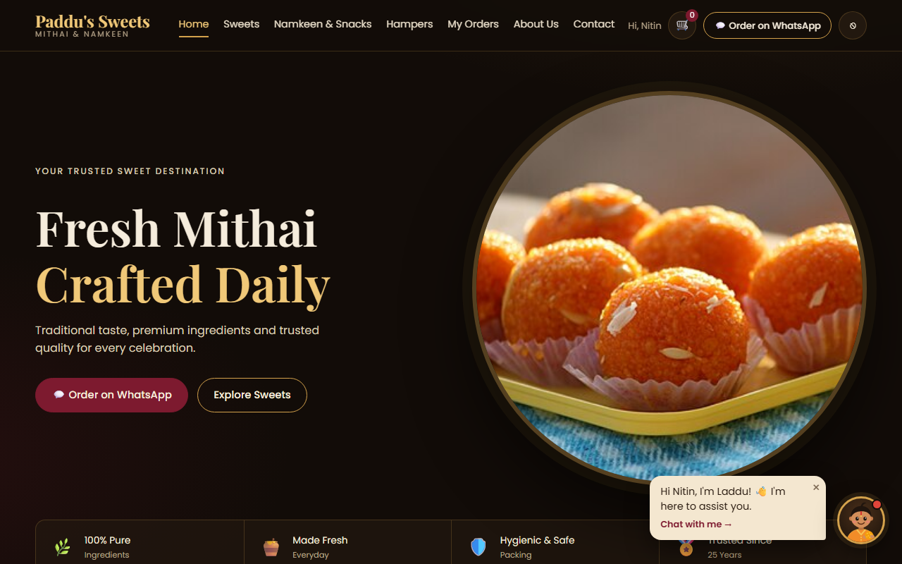
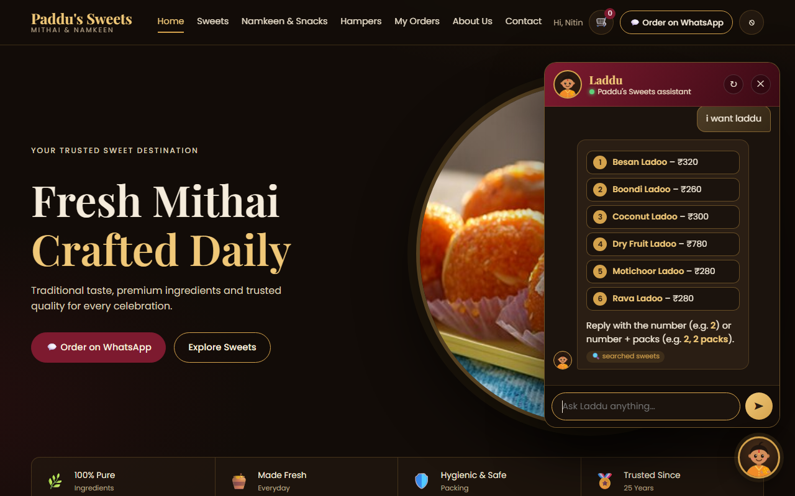
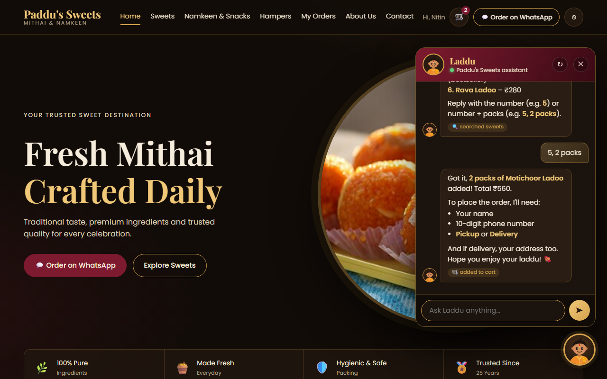
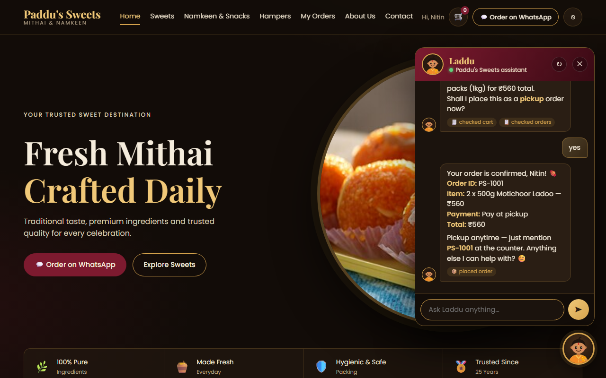
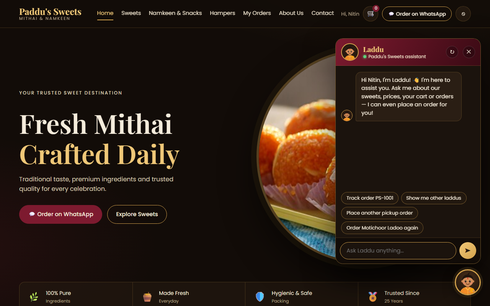
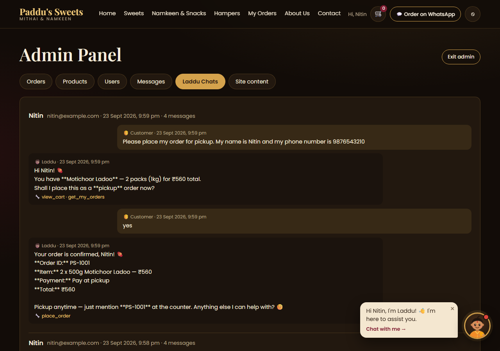
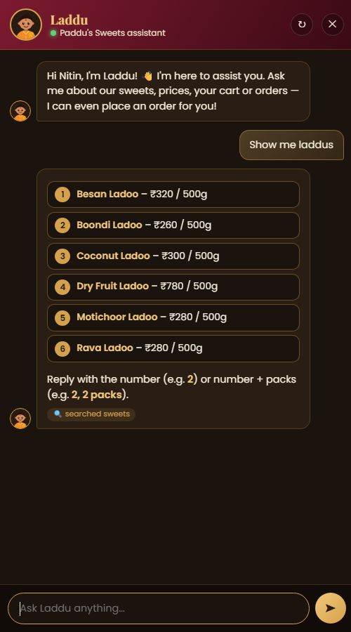

# Laddu 👦🏽🟠 — Agentic AI Chat Widget for a Sweet Shop

**Laddu** is an AI shopping assistant that lives in the corner of a website. He is drawn as a cute traditional
Indian boy, greets every customer by name, answers from the shop's **live database**, adds items to the **real cart**
and **places orders** — only after the customer says *yes*.

Built from scratch — **no agent framework** — to show how *agentic AI* really works:
an LLM ([Sarvam AI](https://www.sarvam.ai/) `sarvam-105b`) + **tools** + a hand-written **agent loop** + **memory**
in MongoDB, served by **FastAPI** and shown in a lightweight **vanilla JS** widget.

> This repository contains **only Laddu** (the widget + agent). It was built for the demo shop *Paddu's Sweets*,
> whose website is not part of this repo — Laddu plugs into any website with two tags (see [Embed](#-embed-laddu-in-a-website)).



---

## ✨ Features

| | |
|---|---|
| 💬 **Greeting popup** | On every visit Laddu waves and says *"Hi Nitin, I'm Laddu! 👋 I'm here to assist you."* |
| 🔍 **Live answers, no guessing** | Prices, stock, timings and orders come from the database through tools — never invented |
| 🔢 **Numbered, tappable choices** | "i want laddu" → all ladoos listed 1–6; reply **5** or tap the button |
| 🛒 **Real cart** | "5, 2 packs" adds to the *same* cart as the website; the page's cart count updates instantly |
| 📦 **Safe ordering** | Shows a summary and places the order **only after an explicit "yes"** (enforced in code) |
| 📋 **Order status & callbacks** | "Where is my order?", "Call me for a wedding order" |
| 🧠 **Personal suggestions** | Every visit starts a fresh chat, with suggestion chips the AI writes from your previous chats & orders |
| 🔤 **Spelling-tolerant search** | "mothichur" → *Motichoor Ladoo*, "rawa" → *Rava Ladoo* |
| 🌐 **Indian languages** | Replies in the customer's language — English, Hindi, Hinglish, Telugu |
| 📱 **Mobile ready** | Full-screen chat on phones |
| 🛡️ **Guardrails** | Tools act only for the logged-in customer, step limit, safe HTML, errors explained not crashed |

---

## 📸 Screenshots (real Sarvam AI replies)

All screenshots were taken with the **real Sarvam AI model** answering (a test copy of the shop's data was used,
so no real customer data is shown). Nothing is edited.

### 1. Numbered choices — the AI searched the database and lists every ladoo
`i want laddu` → Laddu calls the `search_products` tool and shows tappable options (tag: 🔍 *searched sweets*).



### 2. Adds to the real cart
`5, 2 packs` → Laddu calls `add_to_cart`; the website's cart count in the header changes to **2**.



### 3. Places an order — only after "yes"
Laddu checks the cart, shows a summary, asks *"Shall I place this…?"* and places order **PS-1001** only after **yes**.



### 4. Next visit: fresh chat + personal suggestions
A new visit starts a clean chat, but the chips were written by the AI from the previous chats:
*"Track order PS-1001"*, *"Order Motichoor Ladoo again"*…



### 5. Every conversation is saved for the shop owner
Admin → **Laddu Chats**: each chat with timestamps and the tools the agent used.



### 6. On a phone



### 7. Watching the agent think (terminal mode)
A real run of `python app.py chat nitin@example.com` — you can see the tool call and the token usage:

```text
Laddu is ready! Chatting as Nitin. Memory is ON. Type 'exit' to quit.

You: what is the price of kaju katli?
   -> sending 2 messages to sarvam-105b with 8 tools
   <- reply | finish_reason=tool_calls | tokens: prompt=1746 completion=52
   🔧 search_products({"query": "kaju katli"}) -> {"count": 2, "products": [{"no": 1, "name": "Kaju Katli", "price": 720, "unit": "500g", ...
   -> sending 4 messages to sarvam-105b with 8 tools
   <- reply | finish_reason=stop | tokens: prompt=1894 completion=1888

Laddu: Hello Nitin!
1. **Kaju Katli** – ₹720 / 500g
2. **Royal Mithai Box** – ₹1199 / box
Reply with the number (e.g. **1**) or number + packs (e.g. **1, 2 packs**).
   (tools used: search_products)
```

---

## 🧠 How it works

```
 Browser (any website)                         Laddu server (FastAPI)                      Outside services
 ┌──────────────────────────┐   POST /api/chat   ┌────────────────────────────────┐
 │ widget.js  👦🏽 popup +   │ ─────────────────► │ chat_api.py                    │
 │ chat panel (widget.css)  │  {message: "5,2"}  │  1. load recent chat (MongoDB) │
 │                          │                    │  2. system prompt (prompt.py)  │
 │                          │                    │  3. run_agent()  (agent.py) ───┼──► Sarvam AI (llm.py)
 │                          │                    │       ◄── "call add_to_cart"   │
 │                          │                    │     run_tool() (tools.py) ─────┼──► MongoDB (core.py)
 │                          │                    │       ◄── final answer         │
 │                          │ ◄───────────────── │  4. save chat, return reply    │
 └──────────────────────────┘ {reply, steps,     └────────────────────────────────┘
                               cart_changed}
```

**The agent loop** (`agent.py`) — the heart of agentic AI:

```python
for _ in range(MAX_AGENT_STEPS):                  # safety limit: 6 rounds
    reply = call_llm(messages, tools=schemas)     # the AI decides
    if not reply.get("tool_calls"):
        return reply["content"]                   # plain text = final answer
    for call in reply["tool_calls"]:              # the AI asked for tools
        result = run_tool(user, call)             # OUR code runs them (the AI never runs code)
        messages.append({"role": "tool", "tool_call_id": call["id"], "content": json.dumps(result)})
```

**The 8 tools** (`tools.py`) — described to the AI with JSON schemas; the AI picks them by name + description:

| Tool | What it does |
|---|---|
| `search_products` | Spelling-tolerant search with live prices & stock; results are numbered for the customer |
| `get_product_details` | One product's full details |
| `get_shop_info` | Address, phone, hours, delivery areas, payment |
| `view_cart` | The customer's cart and total |
| `add_to_cart` | Adds packs to the real cart (checks stock) |
| `place_order` | Places the order — refused unless `confirmed=true` after a summary |
| `get_my_orders` | Recent orders and their status |
| `request_callback` | Asks the shop team to call back (bulk / wedding orders, complaints) |

**Memory:** every message (including hidden tool calls/results) is stored in MongoDB `conversations`. Only the last
24 messages are sent to the AI (the *context window*). Every visit starts a fresh chat; old chats power the
**personal suggestion chips** (`suggestions.py`), cached in `laddu_memory` so the AI is called only when something is new.

---

## 🛠️ Tech stack

| Technology | Why it's used |
|---|---|
| **Python 3.10** | Backend language; the standard for AI work |
| **FastAPI** + **Uvicorn** | Turns Python functions into the chat API; auto docs at `/docs` |
| **Pydantic** | Validates incoming JSON (`{"message": ...}`) |
| **Sarvam AI** `sarvam-105b` | The LLM — strong in English **and Indian languages**, supports tool calling |
| **httpx** | Calls the Sarvam API over plain HTTP (no SDK, so the real JSON is visible) |
| **MongoDB Atlas** + **PyMongo** | Products, carts, orders, chats — chat messages are naturally JSON documents |
| **python-dotenv** | Keeps secrets in `.env`, out of the code |
| **Vanilla JavaScript + CSS** | The widget: no framework, no build step; ~250 lines |
| **Inline SVG** | The mascot is drawn with shapes — no image files, sharp at any size |

No LangChain or other agent framework — the loop is written by hand on purpose.

---

## 📁 Project files

| File | Job |
|---|---|
| `app.py` | Runs **Laddu on his own**: the chat API + widget files + CORS (`python app.py`), and terminal chat (`python app.py chat …`) |
| `chat_api.py` | The web API the widget talks to (`/api/chat…`), chat memory in MongoDB, admin chat list, serves `widget.js`/`widget.css` |
| `agent.py` | `run_agent()` — the agent loop; fills the system prompt with live values |
| `llm.py` | `call_llm()` — one call to Sarvam AI (retry, cleanup of hidden "thinking") |
| `tools.py` | The 8 tools, fuzzy search, tool schemas, safe `run_tool()` |
| `prompt.py` | **All the text that shapes Laddu**: personality & rules, tool descriptions, suggestion prompt, default greeting/popup/chips |
| `suggestions.py` | Personal suggestion chips written by the AI from previous chats & orders |
| `terminal.py` | The terminal playground (see every AI call and tool step) |
| `core.py` | Shared with the shop website: MongoDB connection, login check, cart & order logic (so Laddu and the website behave identically) |
| `widget.js` | The chat widget in the browser: mascot, popup, chat panel, tappable options |
| `widget.css` | The widget's look (dark & gold theme, animations, phone layout) |
| `requirements.txt` | Python libraries |
| `.env.example` | Template for your settings/secrets |

---

## ✅ Requirements

- **Python 3.10+**
- A **MongoDB** database (e.g. free MongoDB Atlas) containing the shop's data — collections `products`, `users`,
  `sessions` (logins), `carts`, `orders`, `site_content`, `shop_info`, `categories`. In this project they are created by
  the Paddu's Sweets website; Laddu adds `conversations` and `laddu_memory` himself.
- A **Sarvam AI API key** — from [dashboard.sarvam.ai](https://dashboard.sarvam.ai)

---

## 🚀 Setup & run

```bash
git clone https://github.com/<your-username>/<your-repo>.git
cd <your-repo>

python -m venv venv
venv\Scripts\activate            # Windows   (macOS/Linux: source venv/bin/activate)
pip install -r requirements.txt

copy .env.example .env           # Windows   (macOS/Linux: cp .env.example .env)
# then open .env and fill in MONGODB_URI and SARVAM_API_KEY
```

**Run Laddu's server:**

```bash
python app.py
# Laddu at http://localhost:8001   ·   interactive API docs at http://localhost:8001/docs
```

**Chat with Laddu in the terminal** (as a customer who exists in the database):

```bash
python app.py chat customer@example.com             # shows every AI call and 🔧 tool step
python app.py chat customer@example.com --no-memory # watch him forget (history dropped each turn)
python app.py chat customer@example.com --raw       # also print the raw JSON from Sarvam
```

---

## 🧩 Embed Laddu in a website

Add two tags, then start Laddu after the customer logs in:

```html
<link rel="stylesheet" href="http://localhost:8001/widget.css">
<script src="http://localhost:8001/widget.js"></script>

<script>
  const LADDU_URL = 'http://localhost:8001';

  // how Laddu talks to his server: adds the customer's login token
  async function ladduApi(path, { method = 'GET', body } = {}) {
    const res = await fetch(LADDU_URL + path, {
      method,
      headers: { 'Content-Type': 'application/json',
                 'Authorization': 'Bearer ' + localStorage.getItem('ps_token') },
      body: body ? JSON.stringify(body) : undefined,
    });
    const data = await res.json();
    if (!res.ok) throw new Error(data.detail || 'Something went wrong');
    return data;
  }

  // after login:
  initLaddu({
    api: ladduApi,                               // required
    toast: msg => console.log(msg),              // optional: small notifications
    onCartChanged: () => refreshMyCartBadge(),   // optional: Laddu changed the cart
  });

  // on logout:
  // ladduReset();
</script>
```

The widget draws all its own HTML, keeps its variables private (an IIFE) and only exposes `initLaddu()` and `ladduReset()`.
Allowed website addresses are set with `LADDU_ALLOWED_ORIGINS` in `.env` (CORS).

---

## 🔌 API

| Method & route | Login | What it does |
|---|---|---|
| `POST /api/chat/start` | customer | Called on every visit: closes the old chat, returns Laddu's texts (greeting, popup, chips) |
| `GET /api/chat/suggestions` | customer | 4 personal suggestion chips from previous chats & orders |
| `POST /api/chat` `{"message": "..."}` | customer | Runs the agent → `{reply, steps, cart_changed, new_chat}` |
| `GET /api/chat` | customer | Laddu's texts + the current chat |
| `DELETE /api/chat` | customer | Start a new chat (↻ button); the old one is kept for the admin |
| `GET /api/admin/chats` | `X-Admin-Password` | Latest 50 conversations |
| `GET /widget.js`, `GET /widget.css` | — | The widget files |

Customer routes need `Authorization: Bearer <session token>` (a token from the shop's `sessions` collection).

---

## 🛡️ Security & guardrails

- The **Sarvam API key stays on the server** (`.env`); the browser never talks to the AI directly.
- **Tools act only for the logged-in customer** — the user comes from the login token, never from the AI.
- **No order without "yes":** `place_order` refuses unless `confirmed=true` — enforced in code, not only in the prompt.
- Prices, totals and stock are calculated **on the server**; stock is reserved atomically.
- Unknown tools, invalid arguments and tool errors are handled; the agent stops after **6 rounds**.
- All chat text is **HTML-escaped** in the widget; messages are limited to 1000 characters.
- Demo limitations: no rate limiting, a simple shared admin password.

---

## 🎨 Customising

| I want to… | Edit |
|---|---|
| Change Laddu's personality or rules | `prompt.py` → `build_system_prompt()` |
| Change how personal chips are written | `prompt.py` → `build_suggestions_prompt()` |
| Add or change a tool | `tools.py` (+ its description in `prompt.py`) |
| Use another Sarvam model | `SARVAM_MODEL` in `.env` |
| Change the look | `widget.css` |
| Change the default greeting / popup / chips | `site_content` in MongoDB (`laddu_*` fields) — defaults in `prompt.py` |
| Change when a chat expires | `CHAT_IDLE_MINUTES` in `chat_api.py` |

---

## 🩺 Troubleshooting

| Problem | Fix |
|---|---|
| `ServerSelectionTimeoutError` at start | MongoDB unreachable — check `MONGODB_URI` and **Atlas → Network Access** (add your IP) |
| *"Laddu is sleeping: SARVAM_API_KEY is missing"* | Add `SARVAM_API_KEY=...` to `.env` and restart |
| *"Sorry, I got a little confused"* | The model used its whole token budget "thinking" — just ask again (Laddu already retries once) |
| Widget doesn't appear on another website | Add that website's address to `LADDU_ALLOWED_ORIGINS` and check the widget URLs |
| `401 Please log in` | The customer's session token is missing or expired |

---

Made with 🍬 while learning agentic AI end to end.


